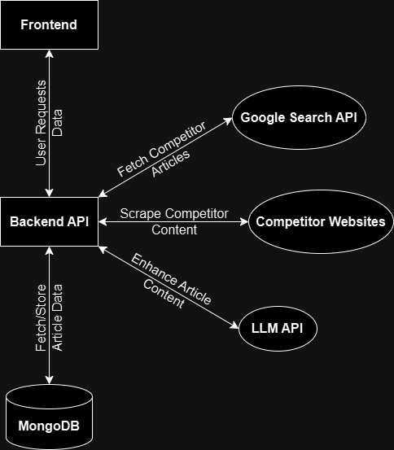

# AI Content Pipeline

## Project Overview

The AI Content Pipeline is a full-stack web application that enhances the content of articles using AI, fetching articles, enhancing them based on the latest web content, and then serving them via a user-friendly frontend.

## Key Features:

- Fetches articles from a custom API.
- Enhances the content using LLM (Large Language Model) APIs.
- Provides a comparison between the original and enhanced versions of the article.
- Displays references from articles that were scraped from the web.
- Fully responsive design with modern animations and effects.

## Architecture Overview

The system follows a clean client–server architecture:



- The **Frontend (React + Vite)** allows users to browse articles and view comparisons.
- The **Backend API (Node.js + Express)** acts as the core orchestrator.
- **MongoDB** stores original articles, enhanced content, and reference links.
- **Google Search API** is used to find competitor articles.
- **Competitor websites** are scraped to extract article content.
- An **LLM API** enhances the original article using competitor insights.

The backend coordinates all external services and ensures enhanced content is persisted and served efficiently.


## Tech Stack

### Frontend:

    

### Backend:

     

## Setup Instructions

### 1. Clone the Repository:
```
git clone https://github.com/psykickguy/content-pipeline.git
```

### 2. Frontend Setup:
```
cd content-pipeline/frontend
npm install
npm run dev
```

Visit http://localhost:5173 to see the application.

### 3. Backend Setup:
```
cd content-pipeline/backend
npm install
```
Create a .env file in the /backend folder:

```
PORT=8080
MONGODB_URI=your_mongodb_connection_string
A4F_API_KEY=your_ai_api_key
SERPER_API_KEY=your_serper_api_key
```
```
nodemon server.js
```

The backend API should be running at http://localhost:8080.

## How to Use

- Open the app in the browser (http://localhost:5173).
- You'll see a list of articles fetched from the backend.
- Clicking on any article opens a modal showing the original and enhanced content side by side.
- You can view references scraped from other websites below the content.

## Live Links

- Frontend Live Link: [https://content-pipeline.vercel.app/](https://content-pipeline-gold.vercel.app/)
- Backend API Live Link: [https://content-pipeline-up.railway.app/](https://content-pipeline.up.railway.app/)

## Contributing

- Fork this repository.
- Clone your fork and create a new branch. ```git checkout -b feature-name```
- Make your changes and commit them. ```git commit -am 'Add new feature'```
- Push to your branch. ```git push origin feature-name```
- Open a pull request.

## License

This project is licensed under the MIT License - see the LICENSE

## Acknowledgments

- OpenAI API for AI-powered content enhancement.
- Vercel and Railway for deployment.
- MongoDB for database management.
